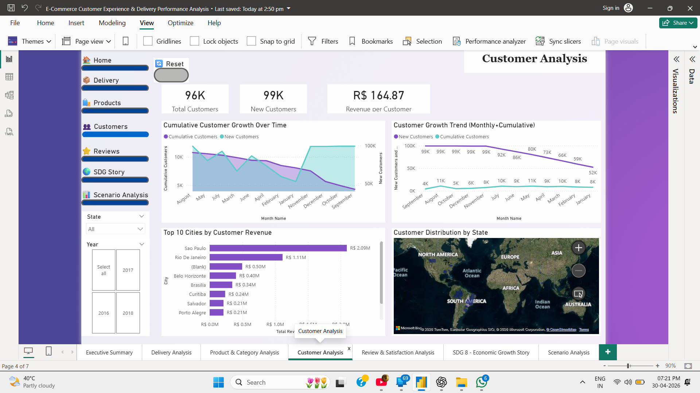
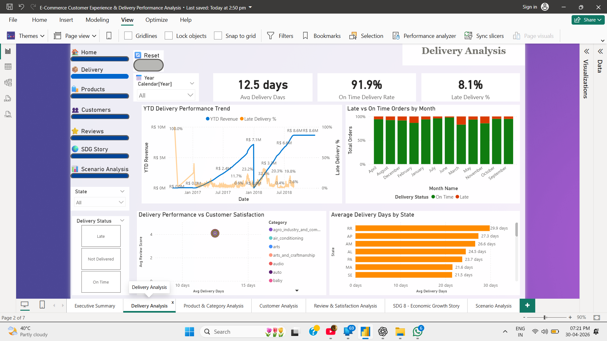
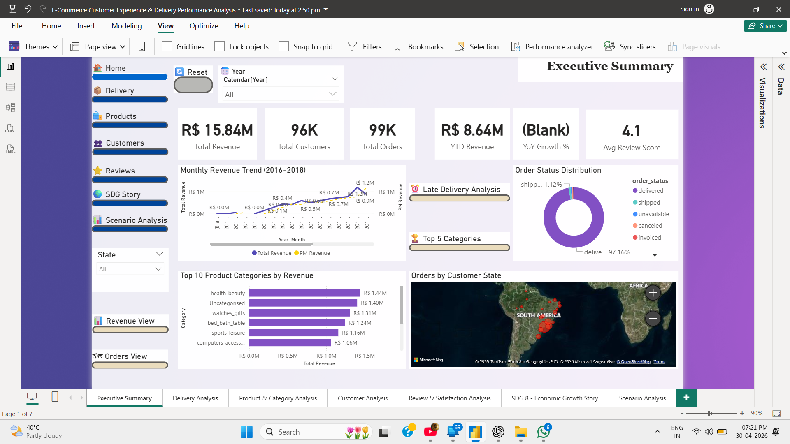

# 📊 E-Commerce Customer Experience & Delivery Performance Analysis

## 📌 Overview

This Power BI project analyzes customer experience and delivery performance in an e-commerce system. It helps identify delivery delays, customer satisfaction patterns, and operational insights.

---

## 🎯 Objectives

* Analyze delivery performance
* Identify delay patterns
* Understand customer behavior
* Improve service efficiency

---

## 📊 Dashboard Features

* 📈 Total Orders, Revenue & KPIs
* 🚚 Delivery Performance Analysis
* 👥 Customer Insights
* 🌍 Region-wise Analysis
* 📅 Monthly Trends

---

## 🧩 Project Structure

* SemanticModel → Data model (tables, relationships, DAX)
* Report → Dashboard visuals
* PDF Report
* Dashboard Images

---

## 🖼️ Dashboard Preview

---

## 🚀 How to Run

1. Open Power BI Desktop
2. Click **Open Project**
3. Select `.pbip` file

---

## 👨‍💻 Author

Vaibhav Awchar
